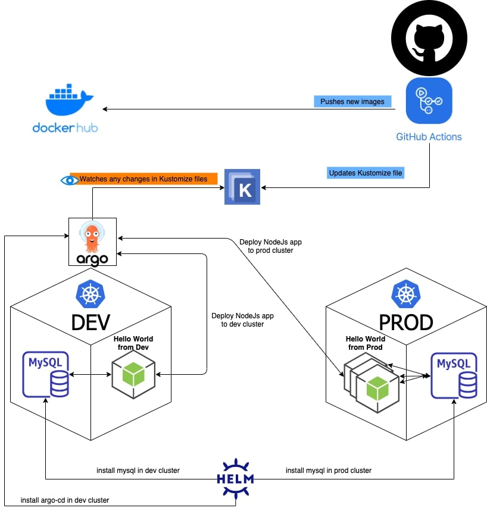

# hello-world-cicd

This is one single repo that contains a NodeJs application showing "Hello World" from a Mysql Database.

It uses Github Actions to build and push a Docker image to Docker Hub and updates kustomize yaml file with the new image tag.

2 Actions secrets needed to be created in the repo in order to be able to push images to Docker Hub:

- `DOCKER_USERNAME`: docker hub username
- `DOCKER_TOKEN`: docker hub token

Argo CD is watching the kustomize file and updates the resource on 2 Kubernetes Clusters: Dev and Prod in which were deployed using Minikube.

Helm is used to deploying Argo CD and Mysql to the Dev Cluster plus another instance of Mysql to the Prod Cluster.


## Architecture Overview:



## Required tools:
These tools need to be present on the system before running init script:

- [Kubectl](https://kubernetes.io/docs/tasks/tools/install-kubectl/)
- [Minikube](https://kubernetes.io/docs/tasks/tools/install-minikube/)
- [Helm](https://helm.sh/docs/intro/install/)
- [ArgoCD](https://argoproj.github.io/argo-cd/cli_installation/)

## How to setup:

1. Clone the repo : `git clone git@github.com:sadok-f/hello-world-cicd.git`
2. Run the setup script like the following:

```sh
 cd hello-world-cicd
./init.sh
```

At the end of the script, the URL to Argo CD will be shown with its initial credentials.
